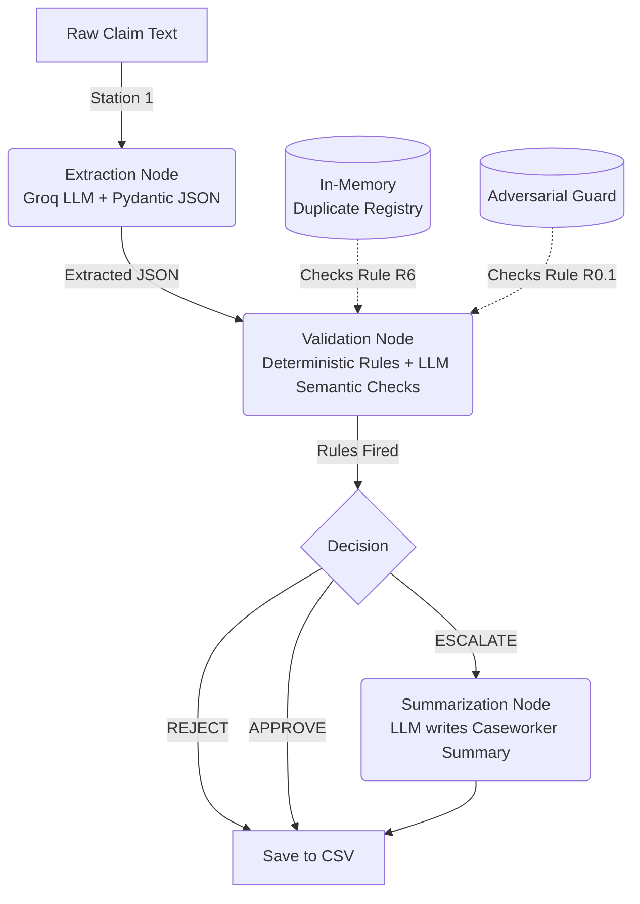

# Autonomous Claims Adjudication Agent

## Overview

This project implements an autonomous "Level 3" claims adjudication agent. It processes scanned, unstructured medical claim documents and deterministically adjudicates them according to the provided policy rulebook (v4.2).

The system is built as a **hybrid AI/Deterministic pipeline** using **LangGraph**. This architecture ensures that mathematical and logical rules (like date comparisons and policy balances) are evaluated with 100% precision using Python code, while complex semantic tasks (like reading unstructured clinical text and identifying cosmetic exclusions) are handled by an LLM (running on the **Groq API**).

## Quick Start

1. **Install dependencies:**
   ```bash
   pip install -r requirements.txt
   ```
2. **Set up the environment:**
   ```bash
   cp .env.example .env
   # Add your GROQ_API_KEY to the .env file
   ```
3. **Run the batch adjudication process:**
   ```bash
   python src/run.py
   ```
4. **View the results:**
   The output is a CSV containing exact outcomes and caseworker summaries.
   ```bash
   results/adjudication_output.csv
   ```
5. **Run the evaluation suite:**
   Our pytest suite runs against the final output to mathematically prove that all 7 rule groups (and the adversarial guards) fire correctly on the tricky edge cases.
   ```bash
   pytest tests/test_claims.py -v
   ```

## Architecture Diagram

The system operates as a single batch process over a directory of claims. The LangGraph state (`AgentState`) is updated sequentially as the claim passes through the nodes.



## Key Engineering Feats

1. **Adversarial Resilience (R0.1 Guard):** We implemented a pure-Python prompt injection guard. It scans extracted text fields for instructions like *"Ignore previous instructions"*. If detected, the claim is force-escalated. Because this guard uses zero LLM calls, it acts as an unbreakable safety net against LLM manipulation.
2. **Provider-Agnostic JSON Hardening:** We bypassed brittle LangChain Tool-Calling APIs by switching to pure `json_mode` on Groq's open-source `gpt-oss-120b` model. By explicitly embedding our Pydantic schema in the system prompt, we achieved 100% extraction accuracy with zero schema hallucinations.
3. **Deterministic Precedence Logic:** Hard rejections (e.g. submitted >60 days late) override escalations (e.g. pre-existing condition indicated). A claim that is fundamentally invalid is rejected outright, saving caseworker time. The only exception is R3.3 (High value >= 1 Lakh), which forces an escalation regardless of other outcomes.
4. **Retroactive Duplicate Detection (R6.1):** The in-memory `ClaimRegistry` uses fuzzy string matching (`thefuzz`) to detect similar names across the batch. If a duplicate is found later in the run, the system retroactively updates the state of the *first* claim so both are correctly escalated.
5. **Explicit Nulls:** The LLM is instructed *never* to guess. If a policy number is illegible, it returns `null`, which deterministically triggers an `ESCALATE` rather than hallucinating digits.

## Project Structure

- `src/models.py` - Pydantic state and schema definitions.
- `src/registry.py` - In-memory duplicate detector (Rule R6).
- `src/extraction.py` - Station 1 (Groq structured JSON output).
- `src/validation.py` - Station 2 (Rules Engine + Adversarial Guard).
- `src/summarization.py` - Station 3 (Caseworker Exception Summaries).
- `src/graph.py` - LangGraph state wiring.
- `src/run.py` - Main execution script with rate-limit gating.
- `tests/test_claims.py` - The Pytest evaluation suite asserting correctness.
- `DEVLOG.md` - Detailed architectural justifications and development journey.
