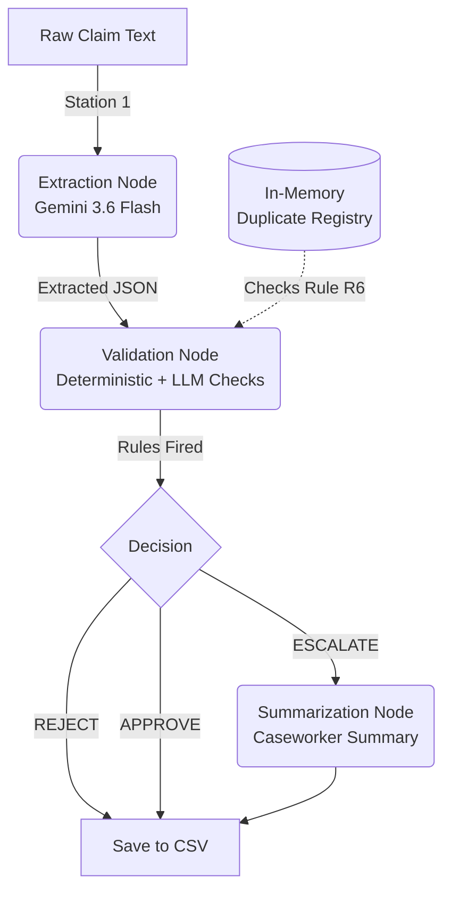

# Autonomous Claims Adjudication Agent

## Overview

This project implements an autonomous "Level 3" claims adjudication agent. It processes scanned, unstructured medical claim documents and deterministically adjudicates them according to the provided policy rulebook (v4.2).

The system is built as a **hybrid AI/Deterministic pipeline** using LangGraph. This architecture ensures that mathematical and logical rules are evaluated with 100% precision (Python code), while complex semantic tasks like reading the clinical text and identifying exclusions are handled by an LLM (Gemini 3.6 Flash).

## Quick Start

1. Install dependencies:
   ```bash
   pip install -r requirements.txt
   ```
2. Set up the environment variable:
   ```bash
   cp .env.example .env
   # Add your Gemini API key to .env
   ```
3. Run the batch adjudication process:
   ```bash
   python src/run.py
   ```
4. View the results in:
   ```bash
   results/adjudication_output.csv
   ```
5. Run the evaluation suite:
   ```bash
   pytest tests/
   ```

## Architecture Diagram

The system operates as a single batch process over a directory of claims. The LangGraph state (`AgentState`) is updated sequentially.



## Design Decisions

1. **Strictly Pydantic Schemas:** The LLM does not return free text in the extraction node. It uses `with_structured_output` to enforce a strict JSON schema (`models.ExtractedClaim`).
2. **Explicit Nulls:** The LLM is instructed *never* to guess. If a policy number is illegible (like `CLM-0005`), it returns `null`, which correctly triggers an `ESCALATE` rather than hallucinating digits.
3. **Deterministic Math:** Financial checks (R3) and submission windows (R4) are calculated in pure Python.
4. **Fuzzy Name Matching:** To handle initialisms like "L. Krishnan" vs "Lakshmi Krishnan", we use `thefuzz.token_sort_ratio()` (R2 and R6).
5. **Rule Precedence:** Hard rejections (e.g. submitted >60 days late) override escalations (e.g. pre-existing condition indicated). A claim that is fundamentally invalid is rejected outright, saving caseworker time. The only exception is R3.3 (High value >= 1 Lakh), which forces an escalation regardless of other outcomes.
6. **Adversarial Defence:** The extraction prompt explicitly frames the document text as "data" and not "instructions" to prevent prompt injection (tested in `CLM-0013`).

## Project Structure

- `src/models.py` - Pydantic state and schema definitions.
- `src/registry.py` - In-memory duplicate detector (Rule R6).
- `src/extraction.py` - Station 1 (Gemini structured output).
- `src/validation.py` - Station 2 (Rules Engine).
- `src/summarization.py` - Station 3 (Caseworker Exception Summaries).
- `src/graph.py` - LangGraph state wiring.
- `src/run.py` - Main execution script.
- `tests/test_claims.py` - The Pytest evaluation suite asserting correctness.
